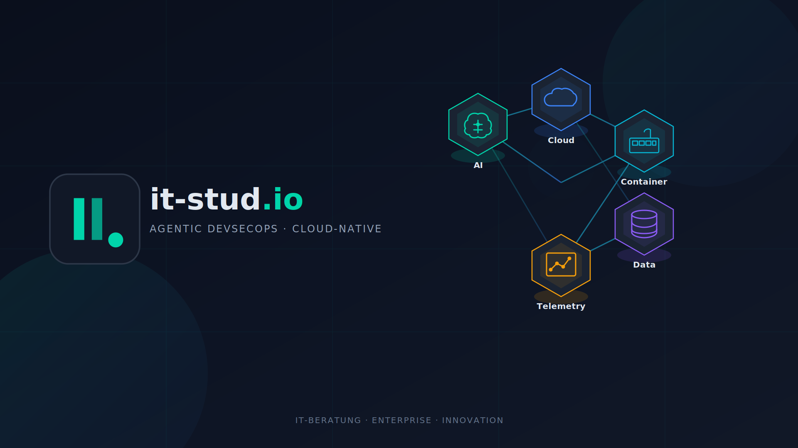

# it-stud.io

**IT-Beratung · Agentic DevSecOps · Cloud-Native Entwicklung**

---

## Über uns

**it-stud.io** ist eine spezialisierte IT-Beratung mit Fokus auf moderne Softwareentwicklung und Security im Enterprise-Umfeld. Gegründet 2020, verbinden wir tiefgreifendes technisches Know-how mit strategischer Beratung.

Unser Ansatz: **Mensch und KI als Team** — wir setzen auf Agentic AI, um höchste Qualität und Effizienz zu liefern.

## 🎯 Schwerpunkte

- **Agentic DevSecOps** — KI-gestützte Entwicklungs- und Sicherheitsprozesse
- **Cloud-Native Architektur** — Moderne, skalierbare Systemdesigns
- **Enterprise IT** — Beratung für komplexe IT-Landschaften
- **Softwareentwicklung** — Von Prototyp bis Production
- **KI-Integration** — LLMs und AI Agents im Unternehmenseinsatz

## 👥 Team

| | Name | Rolle |
|---|------|-------|
| 👨‍💼 | **[Chris](https://github.com/it-stud-io)** | CEO & Stratege |
| ⚡ | **[Simon](https://github.com/simon-itstudio)** | CTO & AI Agent |

## 🎮 Open Source

Wir teilen ausgewählte Projekte mit der Community:

- **[games](https://github.com/ITSTUD-IO/games)** — Browser-Spiele im it-stud.io Design ([Live Demo](https://itstud-io.github.io/games/))

## 📫 Kontakt

- 🌐 **Web:** [it-stud.io](https://it-stud.io)
- 📧 **E-Mail:** info@it-stud.io

---

  <i>Innovation durch Expertise ⚡</i>

